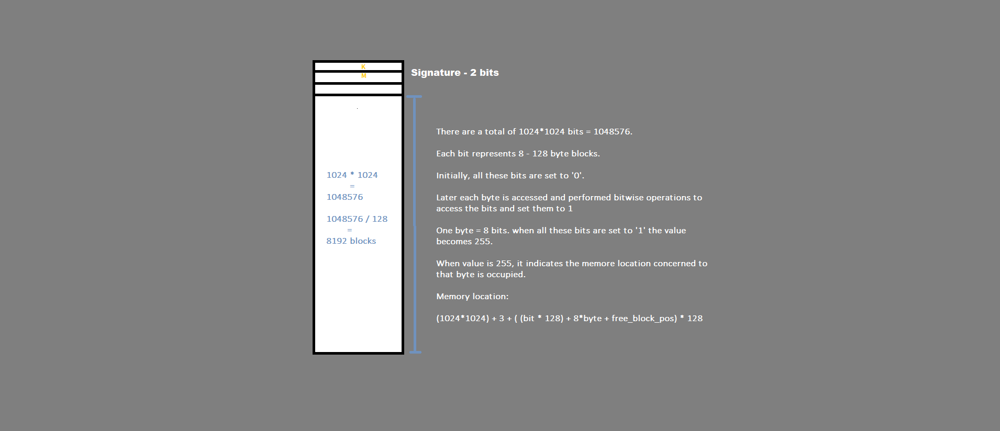
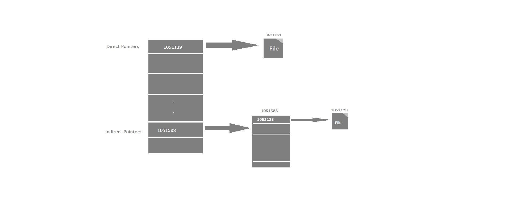

# Inode-Single-Indirect-Implementation

# ProblemStatement

      To build a C++ application that handles five different forums, its users, their msgs, likes and comments. 
      The whole idea of this project is to implement the Inode data structure in accessing the memory. 

# Implementation

   * I have used a file of 1MB for the memory access representing each bit as a 128-bytes block. Given a byte(8-bits), the value of byte is set to 255 when
   all the 8-bits are occupied( or set to 1). And each bit is set to 1 when it is mapped to a 128-bytes block.

   * Keeping the size of file(1MB) in mind, I have implemented Inode using only single direct and single indirect pointers.
   
# Structure of modules:

I designed the modules as follows:

    a) Groups = { group_title (char, 20)    - 20 bytes,
                  message_count (int, 1)    -  4 bytes,
                  description (char, 30)    - 30 bytes,
                  message_direct (int, 10)  - 40 bytes,
                  message_indirect (int, 5) - 20 bytes,
                  user_admin (char, 10)     - 10 bytes,
                  user_information(int, 1)  -  4 bytes } = 128-bytes
                  
    b) Messages= { user_name (char, 8)      -   8 bytes,
                  likes_count (int, 1)      -   4 bytes,
                  comments_count (int, 1)   -   4 bytes,
                  message_body (char, 180)  - 180 bytes,
                  comment_direct (int, 10)  -  40 bytes,
                  comment_indirect (int, 5) -  20 bytes} = 256-bytes
                  
    c) Comments= { user_name (char, 8)         -   8 bytes,
                  comment_likes_count (int, 1) -   4 bytes,
                  comment_body (char, 112)     - 112 bytes} = 128-bytes
                  
    d) Users = {  user_name (char, 31*8)    - 248 bytes,
                  user_count (int)          -   4 bytes   } = 256-bytes
                  
    e) blockPointers = { pointers (int, 32)  - 128 bytes  } = 128-bytes

# Implementation:

I would like to explain implementation in following sections:

1) Inode architecture: Inode is a datastructure used in UNIX-OS for file system management. I have considered this 
data structure to understand how bit-level operations are managed, and implementation.

2) Block Pointers: Two structures are concerned with direct & single indirect pointers, groups & messages. Groups structures
has to store the address of the messages for this purpose I have used 10 - Direct pointers, and 5 - Indirect pointers. 

